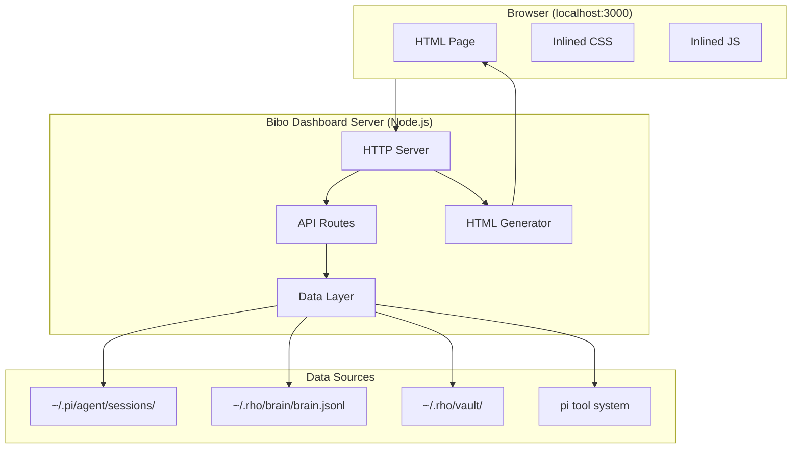
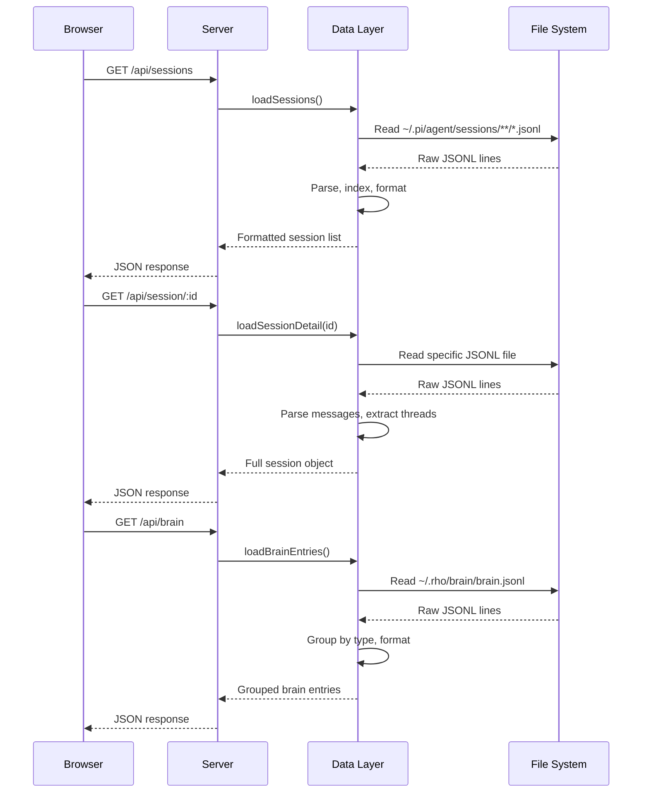
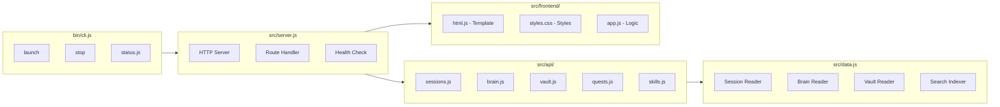

# Bibo Dashboard — Detailed Design

## Connections

- [[../rough-idea.md]]
- [[../idea-honing.md]]
- [[../research/session-format.md]]
- [[../research/brain-format.md]]
- [[../research/vault-format.md]]
- [[../research/dashboard-patterns.md]]
- [[../research/technical-architecture.md]]

---

## 1. Overview

**Bibo Dashboard** is a self-contained web UI for the bibo coding agent. It runs as a localhost HTTP server on port `3000` and provides:

- **Session browser** — View, search, and read all pi coding agent sessions
- **Brain explorer** — Browse and manage brain memory entries (learning, behavior, preference, context, etc.)
- **Vault viewer** — Read vault notes with wikilink support
- **Quest manager** — View active quests, mark them complete
- **Skill launcher** — Trigger skills, view skill details
- **System status** — Real-time view of bibo's current state (model, thinking level, active tasks, token usage)
- **Control panel** — Actions like complete quests, trigger skills, view config

The dashboard is a **skill** that launches when invoked, auto-opens the browser, and runs as a background process.

---

## 2. Detailed Requirements

### 2.1 Core Features

| ID | Feature | Description | Priority |
|----|---------|-------------|----------|
| FR-01 | Session Browser | List all sessions grouped by project, show preview, search by text | P0 |
| FR-02 | Session Detail | View full session with messages, tool calls, thinking, usage | P0 |
| FR-03 | Brain Explorer | Browse brain entries grouped by type, search, view details | P0 |
| FR-04 | Vault Viewer | Browse vault notes, view content with wikilinks | P0 |
| FR-05 | Quest Manager | View active quests, mark complete | P0 |
| FR-06 | System Status | Real-time display of model, thinking level, active tasks | P0 |
| FR-07 | Skill Launcher | List skills, trigger them, view details | P1 |
| FR-08 | Search | Client-side fuzzy search across sessions and brain entries | P1 |
| FR-09 | Config View | Display current pi config, model settings | P1 |
| FR-10 | Export | Export session to Markdown | P2 |

### 2.2 Non-Functional Requirements

| ID | Requirement | Details |
|----|-------------|---------|
| NFR-01 | Zero dependencies | No npm install, works with Node.js stdlib only |
| NFR-02 | Localhost only | Runs on 127.0.0.1:3000, no external network calls |
| NFR-03 | Single process | All server logic in one Node.js process |
| NFR-04 | No build step | Single HTML page with inlined CSS/JS |
| NFR-05 | Fast startup | < 1 second from launch to first render |
| NFR-06 | Low memory | < 20 MB RSS for the server process |
| NFR-07 | Dark theme | Default dark theme, readable in any lighting |
| NFR-08 | Responsive | Works on desktop, readable on mobile |

### 2.3 Constraints

- Must not modify pi-coding-agent core code
- Must not require user authentication (localhost is trusted)
- Must work with any pi-coding-agent version (>= 0.70.0)
- Must handle missing data gracefully (e.g., no sessions, empty brain)

---

## 3. Architecture Overview

### 3.1 High-Level Architecture



### 3.2 Data Flow



### 3.3 Component Diagram



---

## 4. Components and Interfaces

### 4.1 Server Component (`src/server.js`)

**Responsibility**: HTTP server, route handling, HTML generation.

**Key responsibilities:**
- Listen on `127.0.0.1:3000`
- Serve HTML page at `GET /`
- Serve API endpoints at `GET/POST /api/*`
- Handle graceful shutdown (SIGINT, SIGTERM)
- Auto-open browser on launch

**API Routes:**

| Method | Path | Description | Auth |
|--------|------|-------------|------|
| GET | `/` | Dashboard HTML page | N/A |
| GET | `/api/sessions` | List all sessions | N/A |
| GET | `/api/sessions/:id` | Full session detail | N/A |
| GET | `/api/brain` | Brain entries grouped by type | N/A |
| GET | `/api/vault` | Vault notes list | N/A |
| GET | `/api/vault/:slug` | Vault note detail | N/A |
| GET | `/api/quests` | Active quests | N/A |
| GET | `/api/status` | Bibo's current state | N/A |
| GET | `/api/skills` | Loaded skills | N/A |
| GET | `/api/search?q=QUERY` | Search sessions+brain | N/A |
| GET | `/api/config` | Current pi config | N/A |
| POST | `/api/quest/complete/:id` | Mark quest done | N/A |
| POST | `/api/skill/trigger/:name` | Trigger a skill | N/A |
| GET | `/api/export/:id` | Export session to Markdown | N/A |
| GET | `/api/health` | Health check | N/A |
| GET | `/api/version` | Dashboard version | N/A |

### 4.2 Data Layer (`src/data.js`)

**Responsibility**: Read and parse all data sources, provide formatted data to API routes.

**Functions:**

```javascript
// Session data
loadSessions()          // Returns: [{id, title, timestamp, cwd, messageCount, preview}]
loadSession(id)         // Returns: {header, messages: [{role, content, timestamp, toolCalls}], usage}
exportSession(id)       // Returns: Markdown string

// Brain data
loadBrain()             // Returns: {learning: [], behavior: [], preference: [], ...}

// Vault data
loadVault()             // Returns: [{slug, name, type, created, updated}]
loadVaultNote(slug)     // Returns: {frontmatter, content, wikilinks: []}

// Quest data
loadQuests()            // Returns: [{id, description, status, ...}]

// Status data
loadStatus()            // Returns: {model, thinkingLevel, provider, active, uptime}

// Skill data
loadSkills()            // Returns: [{name, description, type}]

// Search
search(query)           // Returns: [{type, id, snippet, score}]
```

### 4.3 Frontend Components

**Three-panel layout:**

```
┌──────────────────────────────────────────────────────────┐
│ Header: Bibo Dashboard v1.0  │  Model: bibo-qwen3.6  │  │
├──────────┬───────────────────────────────────────────────┤
│ Sidebar  │ Main Content Area                             │
│          │                                               │
│ Sessions │  Session List / Detail / Brain / Vault        │
│ Brain    │                                               │
│ Vault    │                                               │
│ Quests   │                                               │
│ Skills   │                                               │
│ Config   │                                               │
│          │                                               │
├──────────┴───────────────────────────────────────────────┤
│ Footer: Last updated: 12:34 PM | Polling: 5s | ⚡ 12ms   │
└──────────────────────────────────────────────────────────┘
```

**Frontend state management:**

```javascript
var state = {
    currentView: 'sessions',  // sessions | session-detail | brain | vault | vault-note | quests | skills | config
    sessions: [],
    currentSession: null,
    brain: {},
    vault: [],
    currentVault: null,
    quests: [],
    status: {},
    skills: [],
    searchQuery: '',
    searchResults: [],
    pollInterval: 5000,
    preferences: {
        theme: 'dark',
        layout: 'list',
        pollInterval: 5000
    }
};
```

---

## 5. Data Models

### 5.1 Session

```javascript
{
    id: string,           // UUID from filename
    timestamp: string,    // ISO8601
    cwd: string,          // Working directory
    messageCount: number, // Total messages
    preview: string,      // First user message text (truncated)
    lastMessageAt: string // ISO8601 of last message
}
```

### 5.2 Session Detail

```javascript
{
    header: {
        version: number,
        id: string,
        timestamp: string,
        cwd: string,
        provider?: string,
        modelId?: string
    },
    messages: [{
        id: string,
        role: 'user' | 'assistant' | 'toolResult',
        content: Array<{type: string, text?: string, thinking?: string, toolCall?: {name, arguments}}>,
        timestamp: string,
        toolCalls: [{name: string, arguments: object, result?: string, isError?: boolean}],
        usage?: {input: number, output: number, cacheRead: number}
    }],
    totalTokens: number,
    duration: string  // Human-readable duration
}
```

### 5.3 Brain Entry

```javascript
{
    id: string,
    type: string,       // learning | behavior | preference | identity | user | context | task | reminder
    text: string,
    created: string,
    category?: string,  // For behaviors: do | dont | value
    path?: string,      // For context entries
    project?: string     // For context entries
}
```

### 5.4 Vault Note

```javascript
{
    slug: string,
    name: string,
    type: string,       // concept | reference | pattern | project | log | moc
    source?: string,
    created?: string,
    updated?: string,
    content: string,    // Markdown content
    wikilinks: string[] // [[wikilink]] references
}
```

### 5.5 Quest

```javascript
{
    id: string,         // 2-digit hex
    description: string,
    status: 'pending' | 'in-progress' | 'done',
    type?: string,      // task type
    priority?: string,
    created?: string,
    updated?: string
}
```

### 5.6 Status

```javascript
{
    model: string,      // e.g., "bibo-qwen3.6"
    provider: string,   // e.g., "jackbox"
    thinkingLevel: string, // "off" | "low" | "medium" | "high"
    active: boolean,    // Is bibo currently working?
    uptime: string,     // Human-readable uptime
    lastActivity: string, // ISO8601 of last activity
    version: string     // pi-coding-agent version
}
```

---

## 6. Error Handling

### 6.1 Error Response Format

```json
{
    "error": "Session not found",
    "code": "SESSION_NOT_FOUND",
    "details": {
        "id": "nonexistent-id"
    }
}
```

### 6.2 Error Codes

| Code | HTTP | Description |
|------|------|-------------|
| `SESSION_NOT_FOUND` | 404 | Session ID doesn't exist |
| `VAULT_NOTE_NOT_FOUND` | 404 | Vault slug doesn't exist |
| `INVALID_QUERY` | 400 | Malformed search query |
| `DATA_READ_ERROR` | 500 | Failed to read data source |
| `TOOL_CALL_FAILED` | 500 | pi tool call failed |
| `SERVER_ERROR` | 500 | Unexpected server error |

### 6.3 Graceful Degradation

- If session files are missing → show "No sessions found"
- If brain.jsonl is empty → show "No brain entries"
- If vault is empty → show "No vault notes"
- If pi tool calls fail → show error message, don't crash
- If data is corrupted → skip that entry, continue with others
- If server port is in use → try next port (3001, 3002, etc.)

---

## 7. Testing Strategy

### 7.1 Unit Tests

Test the data layer functions independently:

```javascript
// Test session parsing
test('parseSessionFile returns formatted session list')
test('parseSessionDetail extracts messages correctly')
test('parseBrainEntries groups by type')
test('parseVaultNote extracts frontmatter and content')

// Test search
test('search returns matching sessions')
test('search returns matching brain entries')
test('search handles empty query')

// Test formatting
test('formatDuration returns human-readable string')
test('truncateText returns truncated text')
test('escapeHTML prevents XSS')
```

### 7.2 Integration Tests

Test API endpoints end-to-end:

```javascript
// Test sessions API
test('GET /api/sessions returns session list')
test('GET /api/sessions/:id returns session detail')
test('GET /api/sessions/:id returns 404 for missing session')

// Test brain API
test('GET /api/brain returns grouped brain entries')
test('GET /api/brain returns empty groups when empty')

// Test vault API
test('GET /api/vault returns vault notes list')
test('GET /api/vault/:slug returns note detail')

// Test error handling
test('GET /api/sessions/:id handles corrupted file')
test('GET /api/health returns 200')
```

### 7.3 Manual Testing

```bash
# Launch dashboard
node bin/cli.js launch

# Verify it opens in browser
curl http://localhost:3000

# Test API
curl http://localhost:3000/api/sessions
curl http://localhost:3000/api/brain
curl http://localhost:3000/api/health

# Stop dashboard
node bin/cli.js stop
```

### 7.4 Visual Testing

- Verify dark theme renders correctly
- Verify responsive layout on mobile
- Verify session messages render with proper formatting
- Verify wikilinks in vault notes render as links
- Verify search results display correctly
- Verify real-time updates work (polling)

---

## 8. Appendices

### 8.1 Technology Choices

| Choice | Selected | Rationale |
|--------|----------|----------|
| Runtime | Node.js | Universal, no install needed, stdlib is sufficient |
| Framework | None (zero deps) | Simpler, lighter, faster startup |
| Frontend | Plain JS | No build step, no modules, no bundler |
| Styling | Inlined CSS | Single HTML file, no external requests |
| Real-time | Polling (5-10s) | Simpler than WebSocket, sufficient for dashboard |
| Search | Client-side fuzzy | Instant, no server load |
| Storage | File system | Direct reads from pi data sources |

### 8.2 Research Findings Summary

From dashboard patterns research:

1. **CodeDash** (zero-dep Node.js) proved that a full dashboard can work in ~235 KB with no dependencies
2. **ccboard** (Rust) showed the value of a single binary, but requires compilation
3. **Client-side search** (trigram fuzzy) is preferred over server-side for speed
4. **Polling** (not WebSocket) is sufficient for dashboard updates
5. **Single HTML page** with inlined CSS/JS avoids build steps and CDN dependencies
6. **REST API** is simpler and more debuggable than GraphQL

From session format research:

1. Pi sessions are v3 JSONL with structured events
2. Messages contain role, content (text, thinking, toolCall), usage data
3. Sessions stored in `~/.pi/agent/sessions/<project>/YYYY-MM-DDTHH-MM-SS-SSSZ_<uuid>.jsonl`
4. Parent IDs link messages in conversation threads

From brain format research:

1. brain.jsonl is append-only, entries grouped by type
2. Update via brain tool API, not direct file editing
3. Dashboard should use brain tool for write operations

### 8.3 Alternative Approaches Considered

| Approach | Why Rejected |
|----------|-------------|
| React/Vue frontend | Over-engineered, requires build step, adds dependencies |
| WebSocket for real-time | More complex, polling is sufficient for dashboard |
| Electron app | Heavy, requires packaging, defeats localhost simplicity |
| Rust binary (like ccboard) | Requires compilation, less portable than Node.js |
| Bun runtime | Requires Bun installed, less universal |
| External database | Overkill, file system is sufficient |
| Authentication | Unnecessary for localhost, adds complexity |

### 8.4 Key Constraints

1. Must not modify pi-coding-agent core code
2. Must not require user authentication
3. Must work with pi-coding-agent >= 0.70.0
4. Must handle missing data gracefully
5. Must not make external network calls
6. Must start in < 1 second
7. Must use < 20 MB RAM

---

## Connections

- [[../rough-idea.md]]
- [[../idea-honing.md]]
- [[../research/session-format.md]]
- [[../research/brain-format.md]]
- [[../research/vault-format.md]]
- [[../research/dashboard-patterns.md]]
- [[../research/technical-architecture.md]]