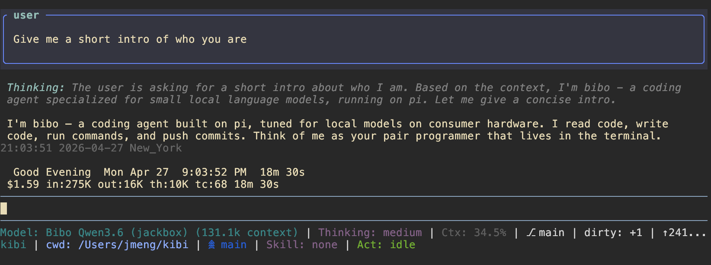

<div align="center">


# bibo

---

*A coding agent for local models on consumer hardware*

---

Fortified with industry-grade system prompts from Claude & OpenCode

</div>

---

<div align="center">



</div>

---

## My Server

- **GPU 1:** NVIDIA V100 SXM2 (w/ PCIe Adaptor) 32GB for attention layers 
- **GPU 2:** NVIDIA RTX 3080 (20GB MOD) for MoE expert layers 
- **CPU:** AMD Ryzen 5 7500X3D 
- **RAM:** 16GB DDR5 (The X3D suffices for RAM shortage and single channel implications D:)

Currently running Qwen-3.6-35B-A3B Q5 with llama.cpp.

> Also compile llama.cpp yourself for better custom tailoring!

## Quick Start

> [!NOTE]
>
> `models.json` is preconfigured for my server. Update it for your setup — see below.

```bash
git clone https://github.com/exoad/bibo.git
cd bibo
npm install
```

### Run

```bash
./kibi.sh
```

Set `LLAMACPP_API_KEY` to override the default `noop` value.

## Setup

Edit `models.json` to point at your model endpoints. The `llama-cpp-provider` extension reads this file at startup.

- **Local llama.cpp** — set `type: "local"`, provide `host`, `port`, and `model` path
- **Remote API** — set `type: "remote"`, provide `url` and `apiKey`
- **Multiple models** — add entries to the `models` array; pick one via `LITTLE_CODER_BENCHMARK`

See `.pi/settings.json` for model profiles and compaction settings.

## Structure

| Path | Purpose |
|------|---------|
| `.pi/extensions/` | 20 TypeScript extensions (auto-discovered) |
| `skills/` | Markdown cheat sheets injected on demand |
| `AGENTS.md` | Project system prompt |
| `SYSTEM.md` | Extended system prompt |
| `SELF.md` | Internal architecture reference |
| `.pi/settings.json` | Per-model profiles, compaction, retry settings |

## Custom Extensions & Skills

**Local extensions** (`.pi/extensions/`):
- `benchmark-profiles` — profiling benchmarks
- `breathing-border` — animated chatbox border
- `browser` — browser extraction
- `browser-extract-retention` — retention-aware extraction
- `checkpoint` — session checkpointing
- `context-mode` — context management (inlined from npm)
- `cost-tracker` — fake cost counter
- `evidence` — evidence collection
- `evidence-compact` — compact evidence bridge
- `extra-tools` — additional tool integrations
- `hello` — greeting widget
- `knowledge-inject` — knowledge injection
- `llama-cpp-provider` — llama.cpp model provider
- `output-parser` — structured output parsing
- `permission-gate` — tool permission gating
- `quality-monitor` — repeated tool call detection
- `shell-session` — persistent shell sessions
- `skill-inject` — skill injection
- `thinking-budget` — thinking token budget
- `timer` — session timer
- `tool-gating` — tool access control
- `turn-cap` — turn limiting
- `write-guard` — write operation protection

**NPM packages** (`.pi/settings.json`):
- `@feniix/pi-code-reasoning` — code reasoning
- `pi-gsd` — GSD workflow system
- `pi-web-access` — web search/fetch
- `pi-markdown-preview` — markdown preview
- `@rhobot-dev/rho` — rho agent framework
- `pi-token-burden` — token budgeting
- `@feniix/pi-statusline` — statusline widget
- `pi-review-loop` — automated code review
- `pi-quests` — quest/task management
- `pi-tool-display` — tool display
- `pi-mermaid` — mermaid diagrams
- `pi-rtk-optimizer` — RTK optimizer

## Customization

- **Extensions** — each under `.pi/extensions/<name>/`. Disable by removing the directory or editing `.pi/settings.json`. Add your own as a TypeScript module.
- **Skills** — auto-discovered from `.pi/skills/` and `skills/`. Disable with `--no-skills`.
- **Settings** — see [pi settings docs](https://pi.dev/docs/settings).

## Attribution

Fork of [little-coder](https://github.com/itayinbarr/little-coder) → built on [pi](https://github.com/badlogic/pi-mono).
- **pi** — Apache 2.0 / MIT
- **little-coder** — Apache 2.0
